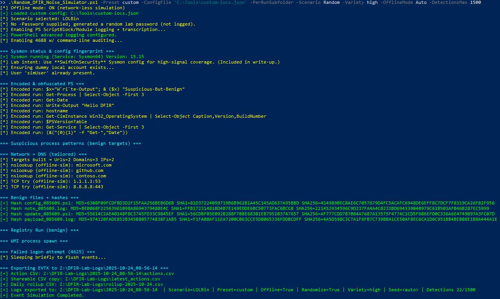

# Run Artifacts — 2025-10-24

**Files**
- [run_log.csv](../../samples/runs/2025-10-24/run_log.csv)  
  Columns: 	imestamp, detections, runtime_sec, cost_usd, integrity, chunk_model, final_model

**Screenshots**
- ForenSynth AI — Latest Run  
  

- Random DFIR Noise Simulator  
  

> Note: Raw \.evtx\ are excluded by design. See \samples/exports/\ for CSV exports,
> and \samples/out_case*\ for full HTML/MD report examples.
